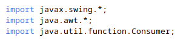
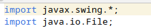
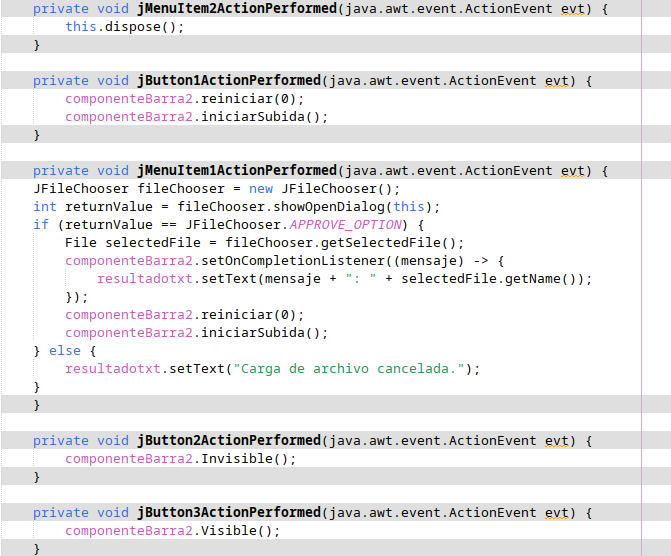
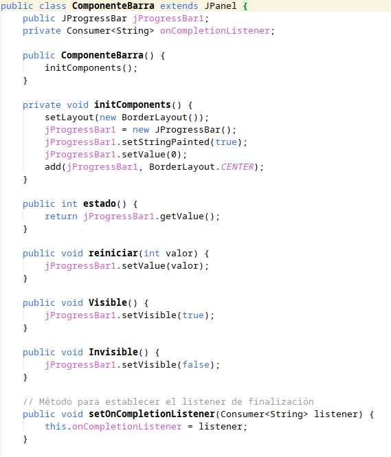
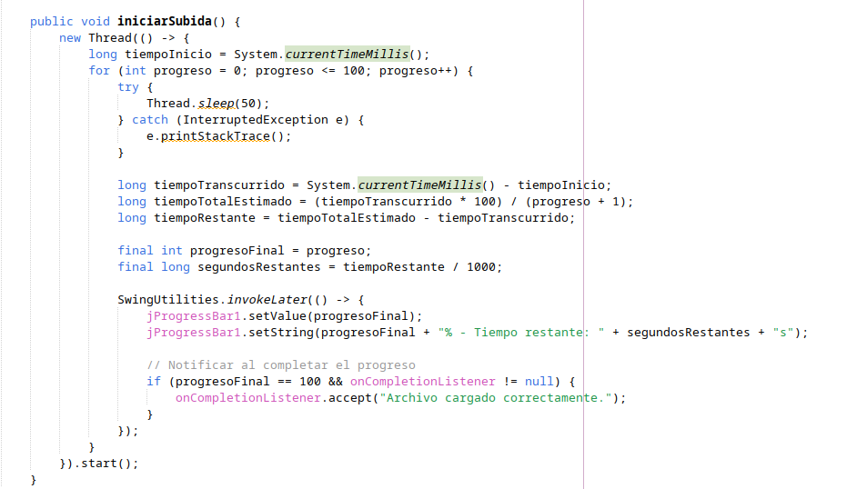
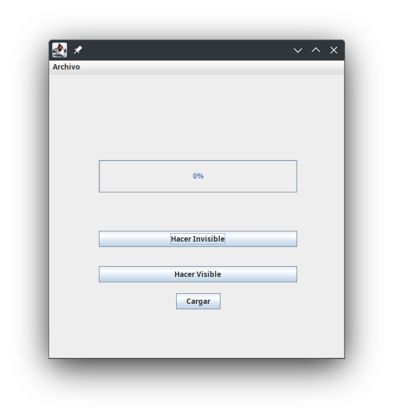
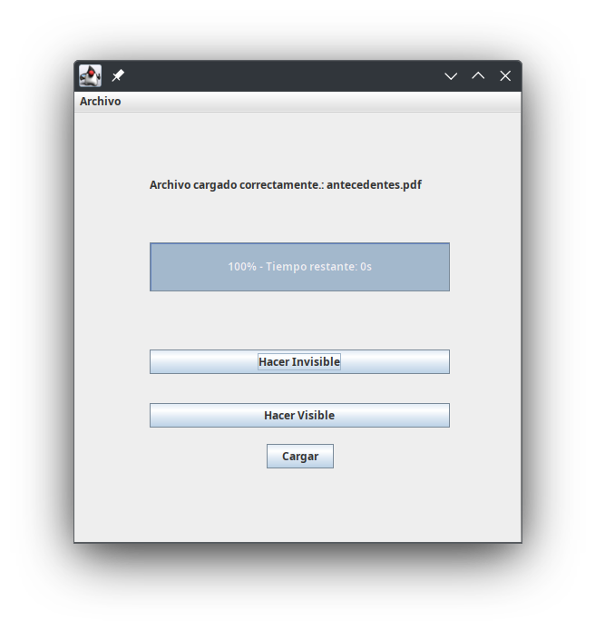

#COMPONENTE BARRA DE PROGRESO 

Proyecto sobre una barra de progreso; 
Muestra el progreso de un archivo a subir mediante
un menú y al finalizar la carga se mostrara un 
mensaje de confirmacion. 

Librerias usadas en la clase del componente

Libreriras usadas en la clase Visual

El siguiente codigo es la funcionalidad de la clase visual:

La llamada a this.dispose(); cierra la ventana actual, liberando 
los recursos asociados con ella.
Cuando el usuario hace clic en jButton1. Aquí se reinicia el
componente componenteBarra2 a un estado inicial (0%) con reiniciar(0);
, y luego comienza un proceso de "subida" o "progreso" llamando 
a iniciarSubida().

El jMenuItem1ActionPerformed

Esta acción se asocia a jMenuItem1 y muestra un cuadro de diálogo para 
elegir archivos (JFileChooser). Si el usuario selecciona un archivo 
y confirma la selección (APPROVE_OPTION), se obtiene el archivo elegido
(selectedFile).

Luego:

    Se configura un "listener" en componenteBarra2 que actualiza el texto
    de resultadotxt cuando la subida se completa. Este texto muestra un
    mensaje seguido del nombre del archivo.
    componenteBarra2 se reinicia a su estado inicial y se inicia el proceso
    de subida.

Si el usuario cancela la selección, se muestra el mensaje 
"Carga de archivo cancelada." en resultadotxt.

El método Invisible() de componenteBarra2 se llama, haciendo que 
el componente sea invisible en la interfaz.

Llama al método Visible() de componenteBarra2, haciendo que el 
componente se muestre en la interfaz si estaba oculto.

Se inicializan los componentes hechos de forma no visual(codigo) y se 
crean unos metodos  para hacer visible, invisible, reiniciar ,
obtener el estado(valor) del progressbar

El metodo iniciar subida:

Creación del Hilo de Subida:

    Se inicia un nuevo hilo para evitar que la interfaz gráfica se bloquee
    mientras se simula la subida. Dentro del hilo, se usa una función 
    lambda para ejecutar el proceso de carga en segundo plano.

Lógica de Progreso:

    Se toma un valor de tiempo inicial (tiempoInicio) para medir el tiempo 
    transcurrido durante la simulación.
    Un bucle for incrementa el progreso del 0% al 100% en intervalos de 50
    milisegundos (50 ms por cada 1%).
    Cada iteración actualiza el progreso e intenta detener el hilo 
    temporalmente usando Thread.sleep(50), simulando el tiempo de espera 
    entre cada incremento del progreso.

Cálculo del Tiempo Restante:

    En cada iteración, se calcula cuánto tiempo ha pasado desde el inicio
    (tiempoTranscurrido) y se estima el tiempo total que tomará el proceso
    usando una regla proporcional.
    A partir de esta estimación, se determina el tiempo restante 
    (tiempoRestante) y se convierte a segundos.

Actualización de la Barra de Progreso:

    Con SwingUtilities.invokeLater(), se asegura que las actualizaciones
    de la barra de progreso ocurran en el hilo principal de la interfaz
    gráfica, evitando errores de concurrencia.
    Se actualiza el valor de jProgressBar1 con el progreso actual
    (progresoFinal) y se muestra el porcentaje de progreso junto al tiempo
    restante en segundos (segundosRestantes).

Notificación de Finalización:

    Cuando el progreso alcanza el 100%, se verifica si existe un
    onCompletionListener configurado. Si está definido, se llama a este
    listener con el mensaje "Archivo cargado correctamente.", notificando 
    que el proceso de subida ha terminado exitosamente.

Es la ejecucion del programa cuando el usuario aun no ha interactuado

El usuario ya subio un archivo y se le mostro el progreso de la subida 
y un mensaje de confirmacion.

Link del video:

https://youtu.be/lA79ZQ-b_QM
